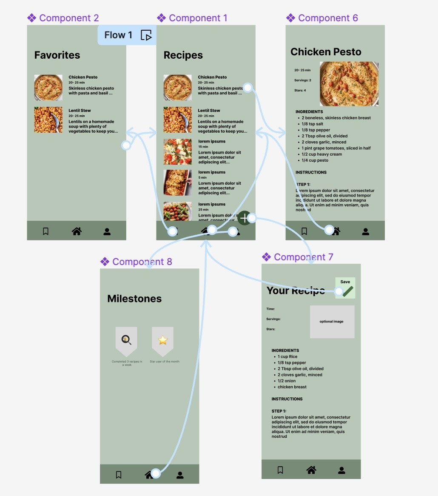
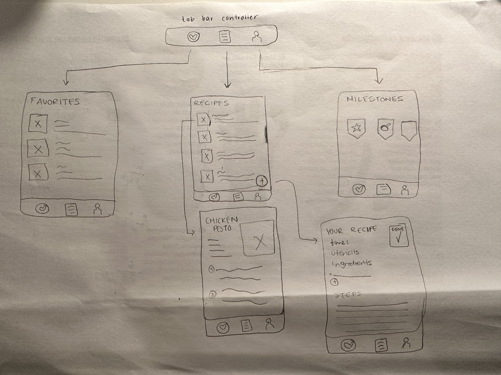
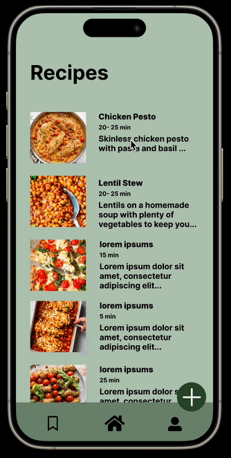

Original App Design Project - README Template

"Recipes for anyone anywhere"

Table of Contents
Overview
Product Spec
Wireframes
Schema
Overview
Description
Easy to go access, to make cooking on a budget easier. It includes recipes for people at different experience levels and dietary restrictions.

App Evaluation

Category: Food 
Mobile: local storage, easy to-go access, offline viewing, easier to use than a computer in the kitchen
Story: making life/cooking easier -> fun
Market: people who work out looking for set dietry needs, young people seeking to learn how to cook
Habit:for each meal they are cooking
Scope: picture, displaying the recipe page, description setup page, nutrition value

Product Spec
1. User Stories (Required and Optional)
Required Must-have Stories

[x] Display list of recipes.
[x]  Display details of each recipe, ingredients, and steps. 
[x]Users can favorite their recipes 

Optional Nice-to-have Stories

* Users can create automatic timers during the process of the recipe 
* User can achieve milestones in cooking
* users can create their own recipes 

2. Screen Archetypes

Stream 
* users can view feed of recipes 

Recipe Details
* Users can see cooking time, ingredients, and steps 
* users can favorite a recipe 
* user can create a timer 

Profile
* Users can see their earned milestones with cooking
* users can see their recipes

...
3. Navigation
Tab Navigation (Tab to Screen)

Home Feed 
Favorite Recipes 
Upload a recipe 

Flow Navigation (Screen to Screen)

Stream Screen
=> Detailed recipes if click on one recipe 

Favorite Recipes
=> None, it should just show list of favorite recipes 

Upload Recipe 
=> Home, after uploading recipe

Wireframes

Schema
Sprint 1: Set up the project and integrate basic Read-only Networking.
- the api was chosen and the endpoints was inserted to ensure the decoding process went smoothly
Sprint 2: Design and implement the Home Screen.
- the screen was built and some design features were added
Sprint 3: Build the detailViewController
- the detial view was succesfully implemented. 
Sprint 4: Implement the favorite button features
-tab bar controller was succesfully implemented. 

Models
all iOS versions, after 2020

Networking
\Stream Screen 
- network request to API to get all recipes displayed in a list 

Favorite Recipes 
- network request to API to show the specfic favorited recipes

